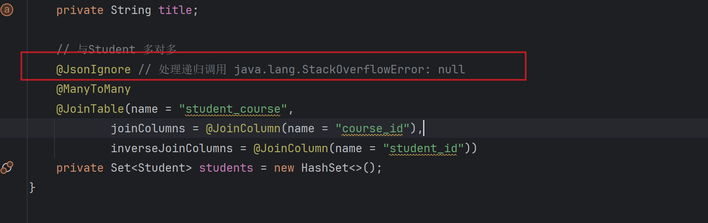

## JPADEMO
This is a demo project for JPA
### 简介
JPA Demo ,对jpa基本的增删改查等操作的运用，
主要针对表的关联关系进行测试（多对多）

### 依赖
- spring-boot-starter-web
- spring-boot-starter-data-jpa
- mysql-connector-java
- spring-boot-starter-test
- lombok

### 笔记
cascade属性
- CascadeType.ALL：所有操作都会级联执行，包括保存（persist）、更新（merge）、删除（remove）等。 
- CascadeType.PERSIST：级联保存操作。 
- CascadeType.MERGE：级联更新操作。 
- CascadeType.REMOVE：级联删除操作。 
- CascadeType.REFRESH：级联刷新操作。
- CascadeType.DETACH：级联脱管操作。

### 踩坑记录
1.响应器返回json数据时，如果实体类中存在循环引用

处理递归调用 java.lang.StackOverflowError: null

